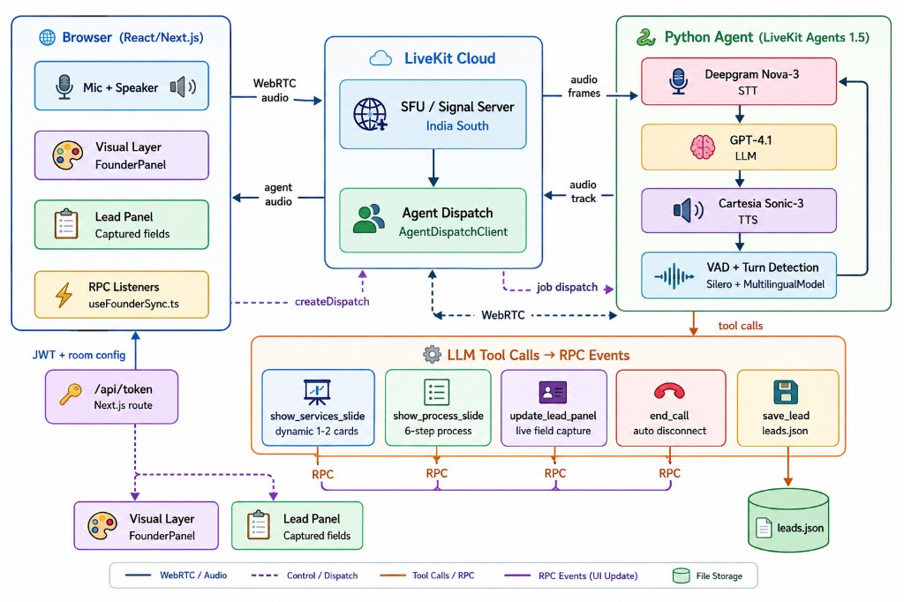

# Maneuver — Talk to Founder
A real-time voice AI that lets website visitors have a natural 
discovery call with Alex, founder of Maneuver. Built with 
LiveKit Agents.

---

## How to run locally

### Prerequisites
- Python 3.10–3.14
- uv — install: `curl -LsSf https://astral.sh/uv/install.sh | sh`
- Node 18+ and pnpm — `npm install -g pnpm`
- A LiveKit Cloud account (free tier works)

### 1. Clone the repo
```bash
git clone https://github.com/dv7453/Voice-assignment.git
cd Voice-assignment
```

### 2. Set up credentials

Create `agent(python)/.env.local`:
```
LIVEKIT_URL=wss://your-project.livekit.cloud
LIVEKIT_API_KEY=your-key
LIVEKIT_API_SECRET=your-secret
OPENAI_API_KEY=your-openai-key
DEEPGRAM_API_KEY=your-deepgram-key
CARTESIA_API_KEY=your-cartesia-key
```

Create `frontend/.env.local`:
```
LIVEKIT_URL=wss://your-project.livekit.cloud
LIVEKIT_API_KEY=your-key
LIVEKIT_API_SECRET=your-secret
AGENT_NAME=my-agent
```

### 3. Start the agent
```bash
cd agent(python)/
uv sync
uv run python src/agent.py download-files
uv run python src/agent.py dev
```

### 4. Start the frontend
```bash
cd frontend/
pnpm install
pnpm dev
```

Open http://localhost:3000 and click Start conversation.

---

## Architecture



| Layer | Components |
|-------|------------|
| **Browser** | React/Next.js — mic/speaker, FounderPanel, lead panel, RPC listeners (`useFounderSync.ts`), `/api/token` |
| **LiveKit Cloud** | SFU / signal server — WebRTC audio, agent dispatch (`RoomAgentDispatch` in token) |
| **Python agent** | LiveKit Agents 1.5 — Deepgram Nova-3 → GPT-4.1 → Cartesia Sonic-3, Silero VAD + turn detection |
| **Tool → UI** | `show_services_slide`, `show_process_slide`, `update_lead_panel`, `end_call` → RPC to frontend; `save_lead` → `leads.json` |

**Legend:** blue = WebRTC/audio · purple dashed = control/dispatch · orange = LLM tool calls · purple solid = RPC events

---

## Models and why

**STT — Deepgram Nova-3**
Lowest latency STT available. Multilingual support out of the 
box — tested in English and Hindi.

**LLM — GPT-4.1**
Strong instruction following for the founder persona. Reliable 
function/tool calling for RPC triggers and lead capture.

**TTS — Cartesia Sonic-3**
~90ms time-to-first-byte. Sounds natural and conversational. 
Significantly lower latency than ElevenLabs for real-time voice.

**VAD — Silero + MultilingualModel**
Built into the LiveKit Agents pipeline. Handles natural pauses 
without cutting the user off mid-sentence.

---

## What the agent does

### Discovery mode (default)
Alex opens the call, introduces himself, and runs a natural 
discovery conversation — one question at a time, following 
threads, not reciting a form. Captures: name, company, role, 
problem, current spend, timeline, budget, fit assessment.

### Q&A mode
If the visitor asks about Maneuver (services, pricing, process, 
case studies), Alex answers from maneuver_kb.md. Switches 
fluidly between modes mid-call.

### Synchronized visual layer
LLM tool calls fire RPC events to the frontend over LiveKit's 
RPC protocol. The React frontend registers handlers and updates 
state immediately — visuals appear as the agent starts speaking.

RPC methods:
- `founder.show_services_slide` → 1-2 contextual service cards 
  generated by the LLM based on the conversation
- `founder.show_process_slide` → 6-step process list
- `founder.update_lead_panel` → live lead field population

### Silence handling
- 6s grace period after agent finishes speaking
- After 15s silence: "Take your time, I am still here"
- After 20s more silence: "I will go ahead and pause here"

### Lead capture
Fields captured silently during the call. Written to 
`leads.json` on disconnect.

---

## What broke and how I fixed it

**Cartesia voice ID 404**
Default voice ID from starter template returned NOT_FOUND 
from LiveKit Inference. Fixed by switching to a valid ID.

**session.wait_for_disconnect() missing**
AgentSession in livekit-agents 1.5.11 does not have this 
method. Fixed using asyncio.Event on room disconnected event.

**RPC cleanup in React**
registerRpcMethod in livekit-client 2.17 returns void. 
Fixed using unregisterRpcMethod in useEffect cleanup.

**Agent dispatch not firing**
Default template uses automatic dispatch which conflicted with 
explicit agentName config. Fixed by adding AgentDispatchClient 
call in the token route.

**LiveKit inference quota**
Free tier inference quota exhausted during testing. Switched 
to direct API keys for STT/LLM/TTS.

**Silence nudge repeating**
session.say() triggered agent_state_changed → speaking, which 
reset nudge flags. Fixed with nudge_speaking guard flag.

---

## What I'd build next with another week

1. **Multi-agent handoff** — discovery agent hands off to a 
   scheduling agent when the visitor is ready to book a call.

2. **Slack notification on call end** — posts lead summary to 
   founder's Slack channel with fit score.

3. **Admin dashboard** — /admin route showing all past leads, 
   call duration, fit scores, transcript replay.

4. **Smarter visual triggers** — stream LLM output and trigger 
   optimistic renders on keyword detection before tool call 
   completes.

5. **Avatar layer** — Anam avatar integration (already 
   commented in starter template) for talking head video.

---

## Sample captured lead

See `leads-demo.json` for a real lead record from a demo call.
